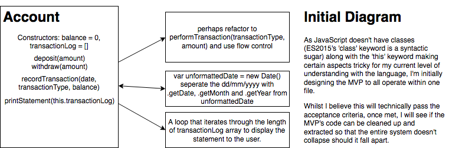

# Bank Tech Test

*"Isn't indirection some sort of spell in World of Warcraft?"*

The bank where Warrior skill speed addicts named Hilde Lydstrom may not wish to open an account. The only concerns with separation at this bank is how much it can _truly_ be done.

## Discussion
- Language used: JavaScript (written in ES6)
- TDD using Mocha/Chai
- Code coverage displayed with Istanblul

## Requirements
- Used within a console (in this case, a browser console)
- User able to deposit/withdraw
- Printing out statements (in the following format: date / credit / debit / balance)
    -  They should be printed in reverse chronological order (newest first)
- Data does *not* need to persist upon console close

## Acceptance Criteria
- User deposits **1000** on **10/1/2012**
- User deposits **2000** on **13/1/2012**
- User withdraws **500** on **14/1/2012**
- Statement output should appear like:
```
date || credit || debit || balance
14/01/2012 || || 500.00 || 2500.00
13/01/2012 || 2000.00 || || 3000.00
10/01/2012 || 1000.00 || || 1000.00
```

## Initial Planning & Diagrams
